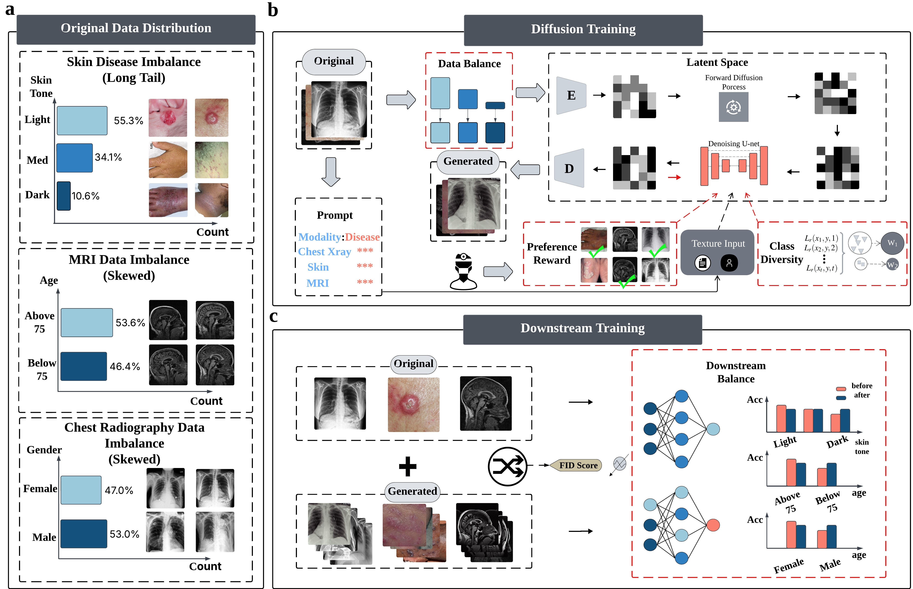

# FairGen

FairGen is a fairness-aware diffusion framework for medical image synthesis and downstream diagnosis. It is designed for three medical imaging settings, including dermatology, brain MRI, and chest X-ray, and focuses on improving coverage for underrepresented demographic subgroups while preserving image quality and diagnostic utility.

This repository includes training, inference, and downstream evaluation code for FairGen and related baselines such as Vanilla Stable Diffusion, CBCB, and CBDM.

<p align="center">
  
</p>

<p align="center">
  <em>FairGen pipeline overview. Starting from imbalanced medical datasets, FairGen combines subgroup-aware data balancing, preference-aligned diffusion training, and downstream augmentation to improve fairness across sensitive attributes such as skin tone, age, and gender.</em>
</p>

## Repository Overview

- Train diffusion backbones for skin, MRI, and chest X-ray synthesis.
- Align generation with physician preferences using DPO-based supervision.
- Generate balanced synthetic datasets for underrepresented subgroups.
- Train downstream diagnostic classifiers with real and synthetic data.

## Training Guide for FairGen

This section provides step-by-step instructions for training FairGen and related baselines for medical image synthesis.

## 1. Environment Setup

Ensure you have the necessary dependencies installed. It is recommended to use a virtual environment (e.g., Conda).

### Option 1: Using `requirements.txt` (Recommended)

If you have the `requirements.txt` file provided in this repository:

```bash
# Create and activate environment
conda create -n fairgen python=3.9
conda activate fairgen

# Install dependencies
pip install -r requirements.txt
```

### Option 2: Using `requirements.txt` (Recommended)

If you prefer to install packages manually or `requirements.txt` is not available:

```bash
# Create and activate environment
conda create -n fairgen python=3.9
conda activate fairgen

# Install core dependencies (ensure CUDA compatibility)
pip install torch==2.8.0 torchvision==0.23.0 --index-url https://download.pytorch.org/whl/cu118
pip install diffusers["torch"] transformers accelerate datasets
pip install wandb umap-learn scikit-learn
```

## 2. Data Preparation

### 2.1 Standard Training Data (For MSE Loss / Regularization)

The training script expects a standard ImageFolder structure or a HuggingFace dataset format.

```text
dataset_root/
├── train/
│   ├── metadata.jsonl  # Contains {"file_name": "img1.jpg", "text": "prompt..."}
│   ├── img1.jpg
│   ├── img2.jpg
│   └── ...
```

### 2.2. Physician Preference Data (For DPO)

Required only for FairGen. You must prepare a JSONL file containing physician-annotated pairs.

File location: `/path/to/dpo_folder/physician_preferences.jsonl`

Format:
```json
{"text": "Demented Age Above 75", "image_w": "path/to/winner.jpg", "image_l": "path/to/loser.jpg"}
{"text": "Skin lesion dark skin", "image_w": "path/to/winner.jpg", "image_l": "path/to/loser.jpg"}
```

## 3. Training Scripts

We provide unified training scripts that handle different modalities (Skin, MRI, Chest X-ray) via the `--modality` flag, located on `diffusers/examples/text_to_image` folder.

### 3.1 Train Baseline Models (Vanilla / CBCB / CBDM / etc..)

Use this command to train baseline models (e.g., CBCB) without DPO alignment.

Example: Training Skin Modality (CBCB)
```bash
export MODEL_NAME="CompVis/stable-diffusion-v1-4"
export TRAIN_DIR="/path/to/your/dataset_skin"
export OUTPUT_DIR="./checkpoints/sd_skin_cbcb"

accelerate launch --mixed_precision="fp16" /path/to/your/train_text_to_imagecbcb.py \
  --pretrained_model_name_or_path=$MODEL_NAME \
  --train_data_dir=$TRAIN_DIR \
  --modality="skin" \
  --use_ema \
  --resolution=512 \
  --center_crop \
  --random_flip \
  --train_batch_size=8 \
  --gradient_accumulation_steps=4 \
  --gradient_checkpointing \
  --mixed_precision="fp16" \
  --max_train_steps=15000 \
  --learning_rate=1e-5 \
  --max_grad_norm=1 \
  --lr_scheduler="cosine" \
  --lr_warmup_steps=0 \
  --output_dir=$OUTPUT_DIR
```
Example: Training MRI Modality (CBCB)
```bash
export MODEL_NAME="CompVis/stable-diffusion-v1-4"
export TRAIN_DIR="/path/to/your/dataset_mri"
export OUTPUT_DIR="./checkpoints/sd_mri_cbcb"

accelerate launch --mixed_precision="fp16" /path/to/your/train_text_to_imagecbcb.py \
  --pretrained_model_name_or_path=$MODEL_NAME \
  --train_data_dir=$TRAIN_DIR \
  --modality="mri" \
  --use_ema \
  --resolution=512 \
  --center_crop \
  --random_flip \
  --train_batch_size=8 \
  --gradient_accumulation_steps=4 \
  --gradient_checkpointing \
  --mixed_precision="fp16" \
  --max_train_steps=15000 \
  --learning_rate=1e-5 \
  --max_grad_norm=1 \
  --lr_scheduler="cosine" \
  --lr_warmup_steps=0 \
  --output_dir=$OUTPUT_DIR
```
### 3.2 Train FairGen Models

FairGen utilizes a dual-stream training process:

*  Regularization Stream: Maintains image fidelity using the original dataset.
*  Alignment Stream: Optimizes for physician preference using DPO.

Key Flags:

`--enable_dpo`: Activates the DPO loss calculation.
`--dpo_data_dir`: Path to the folder containing physician_preferences.jsonl.
`--beta_dpo`: The λ parameter in Eq. 8 (Controls preference strength). Default is 0.5.

Example: Training Skin Modality (FairGen)
```bash
export MODEL_NAME="CompVis/stable-diffusion-v1-4"
# Ideally, load a pre-trained baseline checkpoint to converge faster:
# export MODEL_NAME="./checkpoints/sd_skin_cbcb"

export TRAIN_DIR="/path/to/your/dataset_skin"
export DPO_DIR="/path/to/your/physician_preference_data"
export OUTPUT_DIR="./checkpoints/sd_skin_fairgen"

accelerate launch --mixed_precision="fp16" /path/to/your/train_text_to_image_FairGen.py \
  --pretrained_model_name_or_path=$MODEL_NAME \
  --train_data_dir=$TRAIN_DIR \
  --modality="skin" \
  --enable_dpo \
  --dpo_data_dir=$DPO_DIR \
  --beta_dpo=0.5 \
  --use_ema \
  --resolution=512 \
  --center_crop \
  --random_flip \
  --train_batch_size=8 \
  --gradient_accumulation_steps=4 \
  --gradient_checkpointing \
  --mixed_precision="fp16" \
  --max_train_steps=15000 \
  --learning_rate=1e-5 \
  --max_grad_norm=1 \
  --lr_scheduler="cosine" \
  --lr_warmup_steps=0 \
  --output_dir=$OUTPUT_DIR
```

## 4. Modality-Specific Configurations

The `--modality` flag automatically adjusts internal parameters (e.g., number of classes for balancing loss).

| Modality | Flag | Internal `num_class` | Key Attributes |
| :--- | :--- | :--- | :--- |
| **Dermatology** | `--modality="skin"` | 15 (3 tones $\times$ 5 diseases) | Skin Tone, Disease Type |
| **Brain MRI** | `--modality="mri"` | 4 (2 ages $\times$ 2 states) | Age Group, Dementia Status |
| **Chest X-ray** | `--modality="chest"` | 10 (2 genders $\times$ 5 diseases) | Gender, Finding Type |

## 5. Hyperparameter Tuning Tips

*   `--beta_dpo` **(Lambda)**:
    *   **Range:** 0.1 to 1.0.
    *   **Increase (e.g., 1.0):** If the generated images do not sufficiently reflect physician preferences (e.g., structural features are still generic).
    *   **Decrease (e.g., 0.1):** If the training becomes unstable or image quality degrades (artifacts appear).
*   `--learning_rate`:
    *   For DPO fine-tuning, a lower learning rate (e.g., `1e-5` or `5e-6`) is often more stable than training from scratch.

## Inference Guide for FairGen

This guide explains how to generate synthetic medical images using trained FairGen models (or baselines like CBCB, CBDM, Vanilla SD).

## 1. Usage

We provide a universal inference script `src/inference.py`.

## 2. Examples (e.g Generate Skin Images)

Skin modality includes 15 subgroups (3 skin tones $\times$ 5 diseases).

```bash
export UNET_PATH="/ocean/projects/ccr200024p/zli27/sd_xray/sd_skin_model/DPO_fairgen_model/checkpoint-15000/unet"
export OUT_DIR="/ocean/projects/ccr200024p/zli27/sd_xray/output/DPO_sd_skin/fairgen"

python /path/to/your/inference.py \
  --modality="skin" \
  --model_path=$UNET_PATH \
  --output_dir=$OUT_DIR \
  --num_images_per_class=1000 \
  --batch_size=4
```

## Downstream Guide for FairGen

This guide outlines the process for training downstream diagnostic classifiers using datasets augmented by FairGen. We provide specialized scripts for three medical imaging modalities: **Chest X-ray**, **Dermatology**, and **Brain MRI**.

## 1. Overview

The downstream task involves training a Vision Transformer (ViT) classifier to diagnose diseases. To address class imbalance and demographic bias, our training pipeline incorporates:

*   **Dual-Label Dataset**: Handles both disease labels (for classification) and sensitive attribute labels (for fairness evaluation).
*   **Stratified Splitting**: Ensures train/val/test sets maintain demographic distributions.
*   **Reweighting Strategy**: Dynamically adjusts sampling weights based on subgroup performance (Adaptive Inverse-Performance Reweighting).


## 2. Data Preparation

### Directory Structure

The training scripts expect the data to be organized in an `ImageFolder` format, where subfolder names contain both **demographic** and **disease** information.

```text
input_dataset_root/
├── downstream_skin/
│   ├── African_people_allergic_contact_dermatitis/
│   ├── African_people_basal_cell_carcinoma/
│   ├── African_people_lichen_planus/
│   ├── African_people_psoriasis/
│   ├── African_people_squamous_cell_carcinoma/
│   ├── Asian_people_allergic_contact_dermatitis/
│   ├── ... (other Asian subfolders)
│   ├── Caucasian_people_allergic_contact_dermatitis/
│   └── ... (other Caucasian subfolders)
├── downstream_xray/
│   ├── female_COVID19/
│   ├── female_Edema/
│   ├── female_Lung_Opacity/
│   ├── female_No_Finding/
│   ├── female_Pleural_Effusion/
│   ├── male_COVID19/
│   ├── male_Edema/
│   ├── male_Lung_Opacity/
│   ├── male_No_Finding/
│   └── male_Pleural_Effusion/
└── downstream_mri/
    ├── Demented_Age_Above_75/
    ├── Demented_Age_Below_75/
    ├── Nondemented_Age_Above_75/
    └── Nondemented_Age_Below_75/
```

And you should also make sure your augmentation dataset directory structure shuold also remain same. You could sync it when you inference the generated diffusion model.

## 3. Training Script Examples

I will take chest xray for example, representing **Dementia status** (Demented vs. Nondemented).

*Note: The MRI script uses a lower default learning rate (`1e-5`) for stability.*

**Command:**

```bash
python src/downstream/classify_reweight_mri.py \
  --data "/path/to/real_mri_data" \
  --aug_data "/path/to/fairgen_mri_data" \
  --lr 1e-5 \
  --batchsize 64 \
  --epochs 10 \
  --best_worst
```
